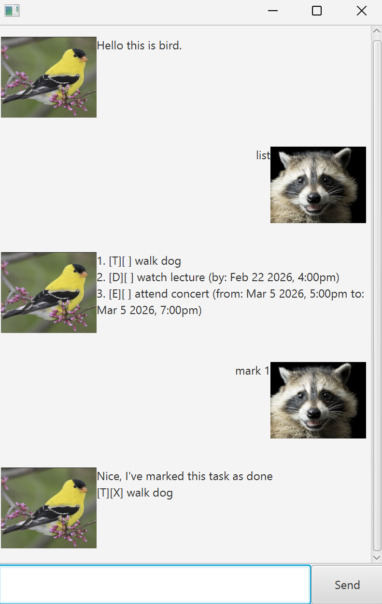

# Bird User Guide



Bird is a task managing chatbot for your daily needs, you can create tasks, mark them and delete them as well.
In addition, you can see which tasks are due.

# Getting started

Requirements: You need to have Java 17 and above 
You can download the Bird jar from here [Download Bird.jar](birdBot.jar)


## Commands

- list

Generates the list of tasks the user currently has.

```
Example: list
```


- find

Generates the list of tasks that matches the keyword the user has given.

```
Example: find walk
```


- mark

Marks the task given as done. The input should be an index with respect to the task list.

```
Example: mark 2
```


- unmark

Unmark the given task. The input should be an index with respect to the task list.

```
Example: unmark 2
```


- delete

Delete the given task. The input should be an index with respect to the task list.

```
Example: delete 2
```


- todo

Add a todo task. The task description should be provided after the todo keyword.

```
Example: todo walk dog
```

- event

Add an event task. The format should be `event <desc> /from yyyy-MM-dd HHmm /to yyyy-MM-dd HHmm`

```
Example: event attend concert /from 2022-12-06 1600 /to 2022-12-06 1700
```

- deadline

Add a deadline task. The format should be `deadline <desc> /by yyyy-MM-dd HHmm`

```
Example: deadline watch lecture /by 2022-12-06 1700
```

- due

See what tasks are due within the next week.

```
Example: due
```